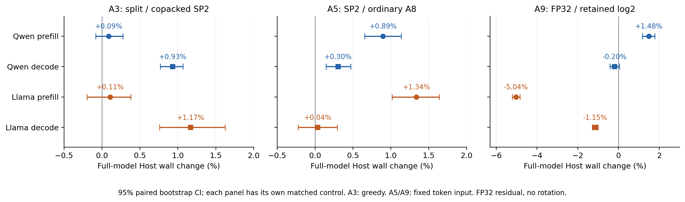

# 无旋转 SP2 / FP32 残差：完整硬件消融结果

已完成用户批准的两模型主消融和附录形状验证。固定高精度残差；未进行 W4→S8 展开对照或整数残差对照。每阶段的有效构建、独立数值范围、失败记录和完整原始计时均封存。新 softmax FP 路径是对照，并未自动晋升为论文基线。

## 建议的论文主张

**原生低比特矩阵乘法的系统收益，取决于表示如何落到物理操作数、生产者何时发布有效数据，以及消费者如何在有限片上空间内排程。** 我们在冻结 W4、SP2 和 FP32 残差的条件下，以正常向量化、正常核内双缓冲的模块化实现为对照，验证完整模型的延迟变化。

直接原生格式本身不是通用加速器：流水是更稳定的收益来源，格式收益及其与流水的交互依赖阶段和模型。SP2 的额外整数工作没有导致成比例的全模成本，但 decode 共装只解释约 1% 的全模收益，不能把全部低开销归功于单一技巧。低比特 softmax 也不具有普遍优势，必须比较实际优化程度和形状。

## 全模消融矩阵

数字为“表中分子/分母”的 Host wall 变化及配对95%CI，单位百分比；正值表示分子更慢。每行是独立冻结实验，不能相加成瀑布总加速，也不能跨行相除作配对结论。A5/A9 使用固定 token 输入，实际 greedy 另列在详细报告。

| 机制及比值方向 | Qwen prefill | Qwen decode | Llama prefill | Llama decode |
|---|---:|---:|---:|---:|
| A1：完整 B11 / 优化模块化 B00 | -13.18% [-13.36, -12.96] | -4.47% [-4.61, -4.34] | -11.63% [-12.30, -11.09] | -2.01% [-2.32, -1.64] |
| A2：关闭 Gate/Up 交错 / all-on | +7.25% [+6.67, +8.17] | +2.33% [+2.19, +2.47] | +7.61% [+7.28, +7.96] | +2.20% [+2.02, +2.38] |
| A2：关闭 raw epilogue 重叠 / all-on | +5.02% [+4.77, +5.27] | -0.04% [-0.25, +0.16] | +4.76% [+4.45, +5.04] | -0.07% [-0.27, +0.10] |
| A2：关闭 decode 权重 lookahead / all-on | -0.19% [-0.55, +0.12] | +1.82% [+1.64, +2.01] | -0.15% [-0.43, +0.17] | +1.16% [+0.93, +1.40] |
| A3：SP2 两独立流 / 物理行共装 | +0.09% [-0.08, +0.28] | +0.93% [+0.77, +1.07] | +0.11% [-0.20, +0.38] | +1.17% [+0.76, +1.62] |
| A5：SP2 / 普通 A8，固定 FP32 残差 | +0.89% [+0.65, +1.14] | +0.30% [+0.14, +0.47] | +1.34% [+1.02, +1.64] | +0.04% [-0.22, +0.29] |
| A9：FP32 HVX softmax / 保留 log2 | +1.48% [+1.17, +1.78] | -0.20% [-0.43, +0.04] | -5.04% [-5.21, -4.84] | -1.15% [-1.29, -1.00] |
| A8：长 KV 关闭 Gate/Up 交错 / all-on | +7.18% [+6.99, +7.44] | +2.95% [+2.72, +3.23] | +7.44% [+7.23, +7.65] | +2.17% [+2.05, +2.28] |

除 A8 外，主实验形状为 M64+15，Qwen cache128、Llama cache80。A8 为 M64+33/cache128，两模型均实际到 KV97；其末尾单 token 只作 tile 边界诊断。A2 的 prefill LOOKAHEAD 和 decode EPILOGUE 对应当前未启用的站点；不把无效开关当作“该机制无用”的证据。Llama QKV ring mask 同样是 no-op，不列入有效机制主表。

## 公平基线与格式×流水交互

B00：紧凑重构值接口＋算子级完成发布；B10：直接原生 tile＋算子级发布；B01：紧凑接口＋分块就绪流水；B11：原生 tile＋分块流水。四格都是完整模型配置。B00 保留正常 HVX、GEMM 内部 DMA/HMX 双缓冲、相同资源上限；没有全局串行化、无效 tensor roundtrip、刻意降低 DMA 粒度或处理无效 decode 行。Qwen 最初不公平的 decode row64 消费打包样本已全部保留并标记无效；主结果只取 consumer-row1-a02 完整重测。

| 条件格式效应 / 交互比值 | Qwen prefill | Qwen decode | Llama prefill | Llama decode |
|---|---:|---:|---:|---:|
| native / 紧凑：算子级调度 | +0.90% [+0.75, +1.06] | +1.46% [+1.34, +1.57] | -0.76% [-1.64, -0.12] | +1.21% [+0.94, +1.50] |
| native / 紧凑：流水调度 | -0.49% [-0.72, -0.26] | +0.25% [+0.02, +0.43] | -0.37% [-0.63, -0.09] | +0.27% [+0.01, +0.54] |
| 延迟交互项 | -1.38% [-1.65, -1.10] | -1.19% [-1.38, -1.03] | +0.39% [-0.34, +1.41] | -0.92% [-1.29, -0.58] |

Qwen prefill 存在支持性的交互，Llama prefill 交互CI跨零效应。因此不能写成“两模型均证明显著协同”。Decode 中 native 格式的条件效应略差，也是有效结果。A6 已验证1层、3层与完整模型；局部百分比没有被外推为全模吞吐。

## 可明确归属的方法贡献

1. **指定 SP2 码本的原生 W4 整数执行映射。** 对公共尺度下可重构为 signed16 的值分解 v=l+256h，high以h+128输入，输出补偿−32768·sum(w)。复用两个 U8 操作数和 packed W4 路径。我们不声称发明 SP2 或进制分解，也不推断 HMX 内部是否展开 W4。
2. **SwiGLU→SP2→消费者原生 tile 的生产接口。** 从冻结 Gate/Up 输入码查表，直接写 low/high，明确有效行、发布粒度和缓冲生命周期；没有独立中间 SP2 索引再展开阶段。两操作数合计2 bytes/元素，不能宣称 HMX 原生读取1 byte SP2 索引，也不能宣称零转换指令。
3. **依照阶段安排 HVX/HMX/DMA 工作。** Gate/Up 交错、raw accumulator 双槽 epilogue、权重 lookahead 和 decode 闲置物理行共装，各有独立完整模型消融。Prefill 与 decode 的关键机制不同；它们共同控制临界依赖与真实墙钟。
4. **将乘法输入精度与残差存储合同解耦。** 原生 W4×A8 点积仍可进入 FP32 epilogue、残差与 Norm 后 A8，保持8MiB且不产生中间 tensor DDR spill。这一批固定 FP32 残差，证明实现与成本，不将旧A8残差当精度合理性对照。

## 表示成本与 softmax 图

每个面板使用自己的同轮对照。Qwen A9 主对照为向量概率码行和；早期带标量统计的 FP 原型完整样本单独封存，不进入主分母。Llama log2 保留各层原除法配置（selected7 EXACT），Qwen 使用宽差值 NR64，不能当作同一个内核跨模型泛化。

FP 概率相对 Float64 的最大误差：Qwen 1.096e-7，Llama 2.194e-7；门槛2e-6，mask零、有限性与自己的 U8 half-up 均通过。同一实际选中层 QKV 的 AV 最大码差分别为 Qwen6/3、Llama7/6（prefill/decode）。这些是两个 softmax 近似之间的差异，不是设备实现错误，不代表 PPL 改善。

## 已完成范围与证据入口

| 项目 | Qwen | Llama |
|---|---|---|
| A1 | [EXP-0274 完整模块表](D:/llm_exp/results/qwen3-block-htp/exp0274/consumer-row1-a02/REPORT.md) | [L32-0029 完整模块表](D:/llm_exp/results/llama32-htp/l32-0029/REPORT.md) |
| A2/A6 | [EXP-0275 完整模块表](D:/llm_exp/results/qwen3-block-htp/exp0275/REPORT.md) | [L32-0030 完整模块表](D:/llm_exp/results/llama32-htp/l32-0030/REPORT.md) |
| A3 | [EXP-0276 完整模块表](D:/llm_exp/results/qwen3-block-htp/exp0276/REPORT.md) | [L32-0031 完整模块表](D:/llm_exp/results/llama32-htp/l32-0031/REPORT.md) |
| A5 | [EXP-0277 完整模块表](D:/llm_exp/results/qwen3-block-htp/exp0277/REPORT.md) | [L32-0032 完整模块表](D:/llm_exp/results/llama32-htp/l32-0032/REPORT.md) |
| A9 | [EXP-0278 完整模块表](D:/llm_exp/results/qwen3-block-htp/exp0278/vsum/REPORT.md) | [L32-0033 完整模块表](D:/llm_exp/results/llama32-htp/l32-0033/REPORT.md) |
| A8 | [EXP-0279 完整模块表](D:/llm_exp/results/qwen3-block-htp/exp0279/REPORT.md) | [L32-0034 完整模块表](D:/llm_exp/results/llama32-htp/l32-0034/REPORT.md) |

A0 基线复现由 Qwen EXP0273 及两模型 A1 全格数值/历史输出核对覆盖；A7 引用 EXP0272 同轮既有证据。A4 与残差维度按用户要求取消。A8/A9 已完成，不再作为待办。所有失败尝试保留，包括不公平旧控制、trace缺失、组件原型、构建与参考准备修复。

完整 HVX/HMX/DMA 时间线因 FARF 输出截断而不可用，不能给出 overlap/utilization 百分比或虚构 bank conflict、硬件 stall。计数器与配对开关能支持条件性能归因，但不能替代缺失的时间线。

数值范围：Llama 包含独立全16层参考与全生成轨迹 token/logit 码；Qwen 包含独立选中层/连续3层、全28层物理与确定性检查、每步实际 final norm/full-vocabulary head。Qwen 未宣称全28层独立CPU transformer等价。两模型 W4A8/SP2 均未在本批做PPL或通用文本质量验收，不能写成“高精度无损量化”。

结构标识：Qwen3 实际28层、hidden2048/FFN6144，Llama3.2-1B-Instruct实际16层、hidden2048/FFN8192。原始config匹配这些维度；不沿用旧文档里冲突的Qwen0.6B标签。不同模型/上下文的绝对速度不作机制加速的分母。

## 完整端到端 token/s

包含 embedding、全部层、final norm、LM head、greedy、FastRPC；排除外部 tokenizer、冷加载和ADB。下面列实际 greedy；所有全模块μs/Host占比和固定输入吞吐见上方各自报告。

| 模型 | 实验/配置 | 形状 | Prefill token/s | Decode token/s |
|---|---|---|---:|---:|
| Qwen | EXP-0277 A8 | M64+15 | 1865.93 | 47.34 |
| Qwen | EXP-0277 SP2 | M64+15 | 1849.98 | 47.13 |
| Qwen | EXP-0278 LOG2 | M64+15 | 1850.83 | 47.14 |
| Qwen | EXP-0278 FP | M64+15 | 1822.61 | 47.23 |
| Qwen | EXP-0279 ALL | M64+33 | 1850.73 | 47.14 |
| Qwen | EXP-0279 FFN | M64+33 | 1726.72 | 45.79 |
| Llama | L32-0032 A8 | M64+15 | 2190.21 | 45.19 |
| Llama | L32-0032 SP2 | M64+15 | 2158.36 | 45.22 |
| Llama | L32-0033 LOG2 | M64+15 | 2165.60 | 45.15 |
| Llama | L32-0033 FP | M64+15 | 2283.81 | 45.65 |
| Llama | L32-0034 ALL | M64+33 | 2173.03 | 44.79 |
| Llama | L32-0034 FFN | M64+33 | 2022.52 | 43.84 |

[全部实验完整模块表合订本](MODULE_TABLES.md)
